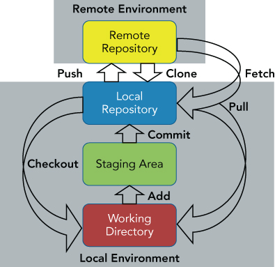

# GIT TUTORIAL

[Git docs](https://git-scm.com/docs/)

Git là một hệ thống quản lý phiên bản phân tán (Distributed Version Control System – DVCS), nó là một trong những hệ thống quản lý phiên bản phân tán phổ biến nhất hiện nay. Git cung cấp cho mỗi lập trình viên kho lưu trữ (repository) riêng chứa toàn bộ lịch sử thay đổi.



## Git init

`git init` Tạo một kho lưu trữ Git trống hoặc khởi động lại kho hiện có

## Git clone

`git clone` Sao chép một kho lưu trử Git và tạo một thư mục mơi

* Sao chép một remote repo:
  
```text
git clone https://github.com/Qaker-VN/Git-tutorial.git
```

## Git add

`git add` thêm nội dung file vào chỉ mục (staging)

```text
git add .            ## thêm nội dung tất cả các file
git add <file-path>  ## thêm nội dung của một file
```

## Git commit

Tạo một cam kết mới chứa nội dung hiện tại của chỉ mục (nội dung staging chưa được commit) và thông báo nhật ký mô tả các thay đổi.

* `git commit -a` tạo commit cho tất cả nội dung file chưa được commit trong chỉ mục vs show trình edit để viết message cho commit
* `git commit -m "msg"` tạo commit cho tất cả nội dung file trong chỉ mục chưa được commit kém với message
* `git commit -C <commit_ID>` tạo commit cho các nội dung file trong chi mục chưa được commit và Lấy message của commit_ID làm message cho commit mới
* `git commit -c <commit_ID>` Gần giống như -C, tạo commit cho các nội dung trong chi mục chưa commit và lấy message của commit_ID, show trình chỉnh sửa message
* `git commit --amend` các nội dung file trong chi mục chưa được commit sẽ được gộp chung vào commit cuối cùng trong git tree vs show trình edit để có thể thay đổi lại message. `git commit --amend -m "msg"` thay đổi nhanh message hoặc --no-edit để không show trình edit message và giữ nguyên message cũ  

## Git remote

Manage the set of repositories ("remotes") whose branches you track.

* `git remote -v` : show tên và url của các remote repository
* `git remote add <name> <url>` : thêm remote repository
* `git remote remove <name>` : xóa remote repository
* `git remote set-url <name> <newUrl>` : thay đổi url của remote repository

> `git remote -h` xem thêm options

## Git push

Cập nhật code từ local repo lên remote repo

* `git push origin master` : cấp nhật nội dung ở local repo lên nhánh master của remote repo
* `git push -f origin master` : ép nhánh master trên remote repo phải overwrite nhánh trên local (không nên sử dung khi không hiểu rõ bạn đang làm gì vì ở đây -f --force sẽ ghi đè lại hết lịch sử của local repo lên remote repo)

> `git push -h` xem thêm options

## Git fetch

Lệnh git fetch tải về dữ liệu từ Remote Repo (kho chứa từ xa - trên server/dịch vụ lưu repo, các dữ liệu như các commit, các file, refs). Các dữ liệu này được lấy về và nó lưu vào kho chứa local (trong Repository - thư mục .git), nó không tác động gì đến thư mục đang làm việc (Working Directory - Workspace). Bạn dùng git fetch khi cần lấy dữ liệu từ remote để lưu trữ, theo dõi các commit người khác đã cập nhật lên server, để có được thông thông tin khác nhau giữa remote và local mà không ảnh hưởng đến luồng công việc bạn đang thực hiện

* `git fetch origin` Kho chứa của bạn tên origin, tải về tất cả thông tin của nó từ remote hoặc `git fetch all`

* `git fetch origin master` Tải về thông tin của một nhánh cụ thể từ remote repo:

Sau khi tải về, để có thể khám phá sự khác biệt giữa local và remote bạn có thể xem trạng thái của thư mục làm việc, xem log của một nhánh local và log của nhánh remote ...

* `git log --oneline origin/master` xem log nhánh master của remote origin
* `git log --oneline master`        xem log nhánh master của local origin
* `git status`                      xem log nhánh master của local origin

## Git pull

Lệnh `git pull` lấy về thông tin từ remote và cập nhật vào các nhánh của local repo. Git tải về thông tin từ remote và ngay lập tức merge cho nhánh đang làm việc. Lệnh `git pull` nó tương đương thi hành luôn hai lệnh `git fetch` và `git merge`

* Khó chứa remote của bạn tên origin, Kéo code từ remote repo về local repo

```text
git pull origin
```

* hoặc chỉ cụ thể tên branch

```text
git pull origin <name-branch>
```

## Git merge

## Git revert

Hoàn nguyên một số cam kết hiện có và tạo một commit mới

Flow:

* `git revert <commitID>` hoan nguyen noi dung cam ket truoc cua commitID, vao che do revert
* Sua cac file conlit bang tay va `git add .` add vao staging
* `git revert --continue` create new commit

> `git revert --abort` cancel revert
>
> `git revert -h` view more options

## Git reset

`Xóa một commit`

## Git rebase

`Set một nhánh làm nhánh cơ sở (base) cho nhánh muốn rebase`

## Git rm

`git-rm - Remove files from the working tree and from the index`

## Git status

`git-status - Show the working tree status`

## Git log

`show commit log`

## .gitignore

---

## Tip

### Change commit message using `git rebase -i`

* `git log --oneline`

```text
59cdd77 (HEAD -> master) commit 4
cef8eac commit 3
1288a45 commit 2
a794f7d commit 1
```

* `git rebase -i HEAD~3` auto open editor

```text
pick 1288a45 commit 2
pick cef8eac commit 3
pick 59cdd77 commit 4
```

* select the commit you want to change the message, use editor to change pick --> reword

```text
reword 1288a45 commit 2
pick cef8eac commit 3
pick 59cdd77 commit 4
```

* save editor, auto switch new editor

```text
commit 2 

# Please enter the commit message for your changes. Lines starting
```

* modify message and save --> change commit message success
